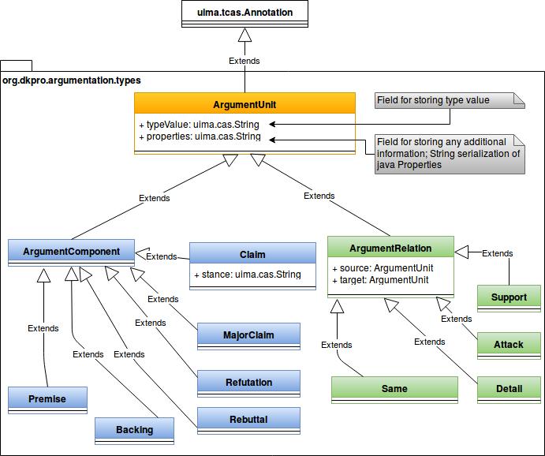

# DKPro Argumentation

[](http://maven-badges.herokuapp.com/maven-central/org.dkpro.argumentation/dkpro-argumentation)

Java framework for demonstration purposes of working with DKPro/UIMA typesystem for argumentation annotation and argumentation mining.

## Requirements

Java 1.8 and higher

## Installation

DKPro Argumentation is available from Maven Central. For working with the UIMA type system, add the following dependencies to your `pom.xml`

```
<dependency>
    <groupId>org.dkpro.argumentation</groupId>
    <artifactId>dkpro-argumentation-types</artifactId>
    <version>0.1.0</version>
</dependency>
```

* Current development version: 0.1.1-SNAPSHOT

## Modules

### org.dkpro.argumentation.types

The UIMA type system is the central part of DKPro Argumentation. It allows one to annotate argument components and relations on top of the UIMA/DKPro framework.

The class hierarchy contains two central classes, ``ArgumentComponent`` and ``ArgumentRelation``.



### IO

Contains ``ArgumentDumpWriter`` class that debugs all argument annotations in a document to the file/stdout.

### Misc

Provides classes to easily operate with argument component annotations.

### Preprocessing

Contains several annotators for casting the problem of argument component identification as BIO tagging (i.e. ``ArgumentTokenBIOAnnotator``)

### Examples

#### Example project for reading annotated data

as shown in

> Habernal, I., Eckle-Kohler, J., & Gurevych, I. (2014). Argumentation Mining on the Web from Information Seeking Perspective. In E. Cabrio, S. Villata, & A. Wyner (Eds.), Proceedings of the Workshop on Frontiers and Connections between Argumentation Theory and Natural Language Processing (pp. 26-39). Bertinoro, Italy: CEUR-WS. Retrieved from http://ceur-ws.org/Vol-1341/

##### Requirements

- Annotated data
  - packaged separately, available at https://www.ukp.tu-darmstadt.de/data/argumentation-mining/argument-annotated-user-generated-web-discourse/

##### How-to

1. Modify paths to gold data
  - Modify `org.dkpro.argumentation.tutorial.ArgumentationCorpusDebugger` and set the `annotatedCorpusDir` variable to point to the gold data located in `gold.data.toulmin` directory
2. Run `ArgumentationCorpusDebugger`
  - It will print annotated argument components, relations, and other info to the std. out
3. Explore it further!
  - Have a look at `org.dkpro.argumentation.io.writer.ArgumentDumpWriter` from the `org.dkpro.argumentation.io.writer` package which shows how to access the argument components, their text, tokens, sentences, etc.


&copy; 2013-2016 UKP

Argumentation Mining Special Interest Group members

https://www.ukp.tu-darmstadt.de/ukp-home/research-areas/argumentation-mining/
